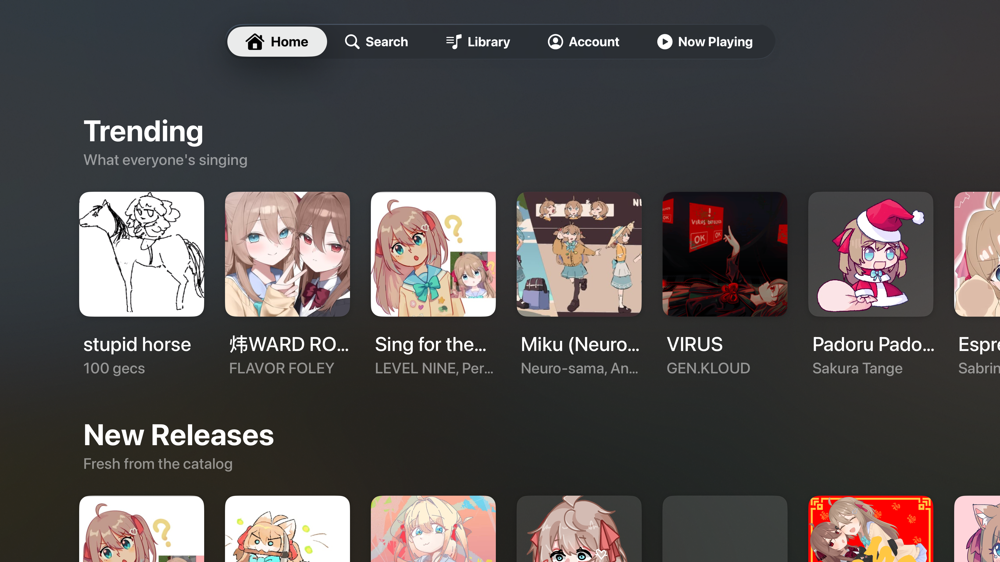
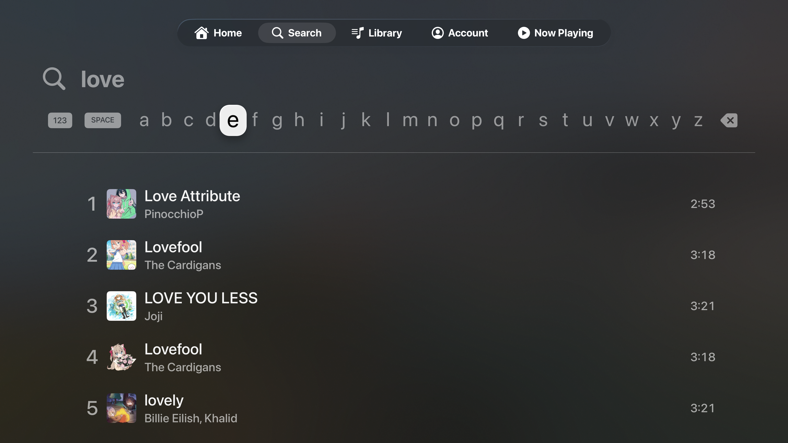
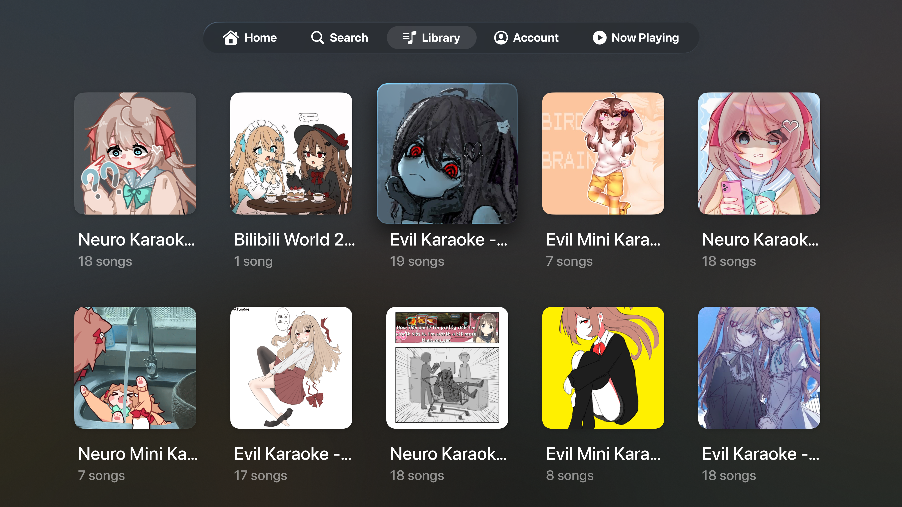
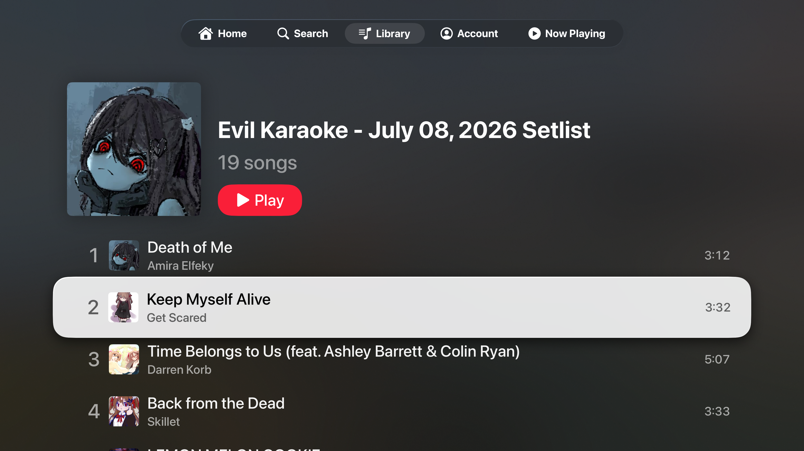
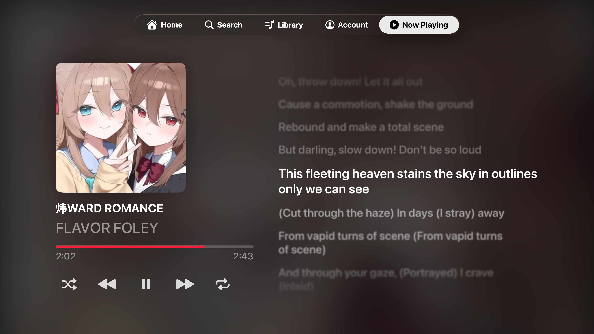
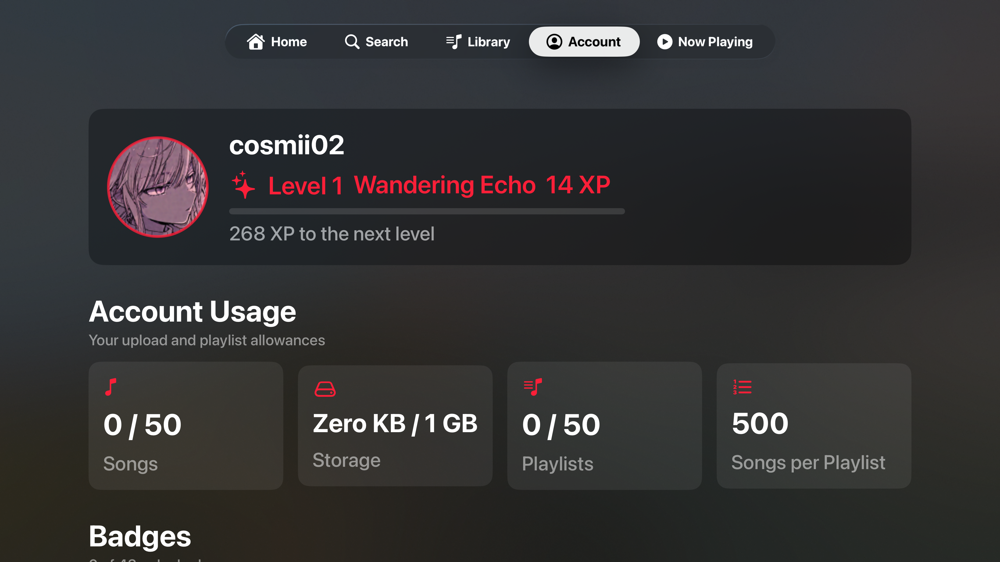

# Apple TV App

Twinskaraoke has a native **Apple TV** app: the whole catalog on the big screen, driven entirely with the Siri Remote — and lyrics large enough for everyone in the room to actually sing along to.

::: info REQUIREMENTS
The Apple TV app requires **tvOS 26 or later**. it is available within the TestFlight or you can also install it by [building from source](#install-on-your-apple-tv) with Xcode.
:::

  
   
  <em>Home — Trending &amp; New Releases</em>

## Features

### Home

The Home screen highlights trending songs and the latest setlists.

### Search

  
   
  <em>Search songs and artists with the on-screen keyboard</em>

### Library

  
  
   
  <em>Every playlist as a poster wall &nbsp;&bull;&nbsp; Full track list behind each one</em>

### Now Playing

  
   
  <em>Full-screen artwork and time-synced lyrics</em>

- **lyrics**
- **Transport controls**
- **Up Next**
- Siri Remote and system controls work as expected.

::: nb
Songs the catalog has no lyrics for fall back to a wider layout with the artwork and Up Next — no empty lyrics panel taking up half the screen.
:::

### Account

  
   
  <em>Your profile, level, uploads and badges</em>

## Install on your Apple TV From Source

The TV app is installed from Xcode over your network — there is nothing to sideload. Follow [Build from Source](/build-from-source) first (including [Part D](/build-from-source#part-d-update-the-apple-tv-app-target) for the Apple TV target's bundle identifier), then:

1. Put your Mac and your Apple TV on the **same Wi-Fi network**.
2. On the Apple TV, go to **Settings** → **Remotes and Devices** → **Remote App and Devices**. It will wait there for a connection.
3. In Xcode, open **Window** → **Devices and Simulators**, find your Apple TV, and pair it (entering the code the TV displays if asked).
4. If your Apple TV asks you to enable **Developer Mode** (Settings → Privacy & Security), turn it on and let it restart.
5. In Xcode, select the **Twinskaraoke TV App** scheme, choose your Apple TV as the run destination, and press the **Play (▶) button**.

::: warning Certificate expiry
As with the iPhone app, a free Apple ID signs the build for **7 days** only. When it stops launching, run it from Xcode again to refresh the timer — you do not need to delete the app.
:::

::: tip No Apple TV to hand?
The **Apple TV simulator** that ships with Xcode runs the app fine for a look around — pick it from the run destination list instead of a physical device.
:::
